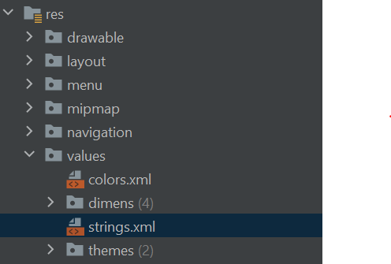
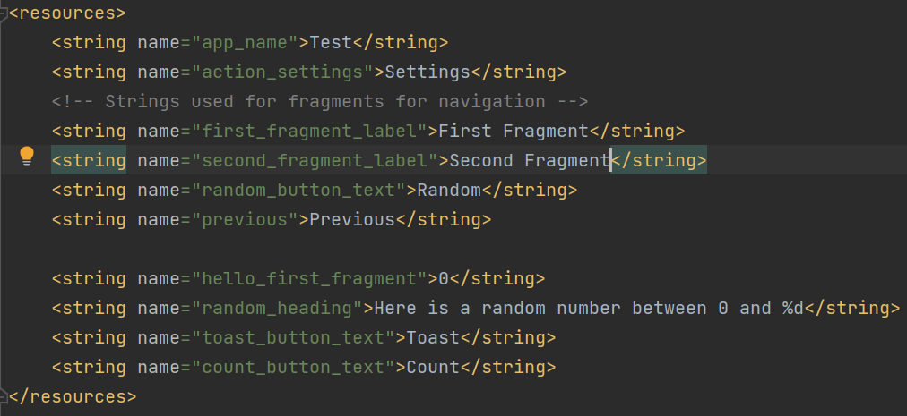

## Créer un string:

### Dans chaque projet d'android studio, il y aura un répertoire "xml" dans "values" qui contient toute les variables déclarées

### On peut declarér un string avec un identifiant plus son contenu pour l'utiliser dans autres fichiers

